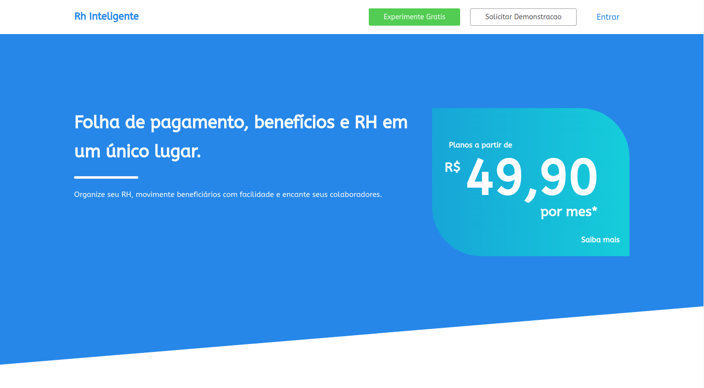
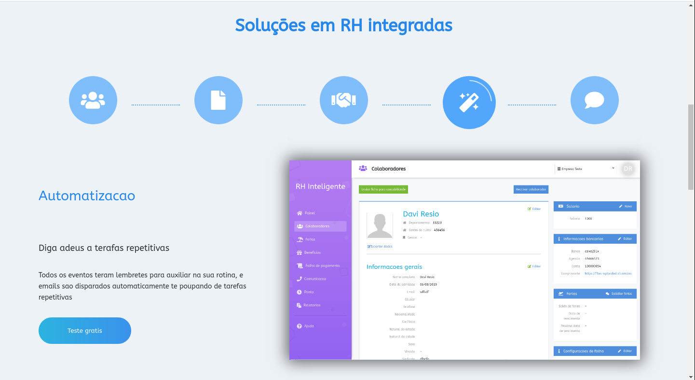
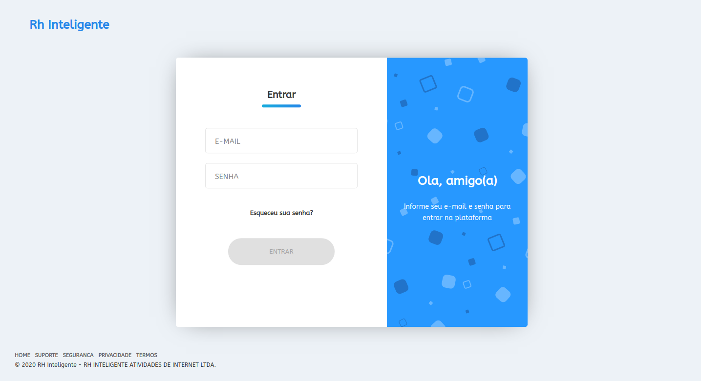
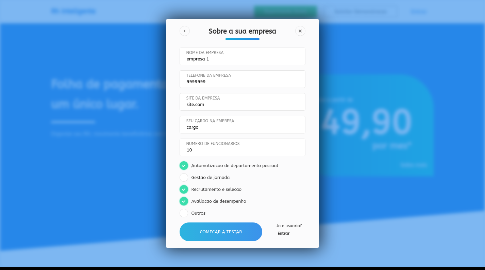

# rh-page

static page feito com gatsby da aplicacao de RH, faz parte de outros projetos integrados, entre eles:

cliente em react que consome a api:

https://github.com/daviresio/rh-client

api principal, no qual faz as requiscoes:

https://github.com/daviresio/rh-server

api que consome uma fila do rabbitMQ e processa eventos e atende algumas chamadas de RPC:

https://github.com/daviresio/rh-server-relatorio

caso queira rodar a aplicacao em sua maquina execute primeiro as 2 apis e os 2 clientes web

depois acesse a pagina statica do gatsby em http://localhost:8000 e faca um cadastro (ou logue, caso ja exista um) 
para ser redirecionado para o cliente web, pois `e necessario estar logado para acessa-lo visto que a api na api os registros
sao baseados nao apenas no usuario, mas tambem a empresa selecionada  

  
  
  
  
